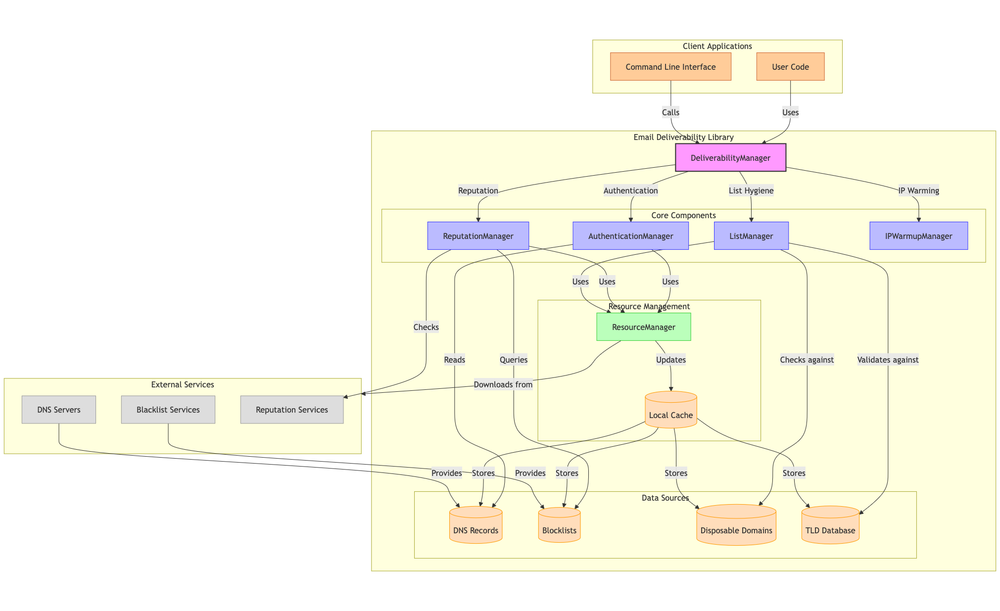

.. _overview:

========
Overview
========

Email Deliverability is a comprehensive Python library designed to help you manage 
and optimize email deliverability. It provides tools for all aspects of email 
deliverability management, from setting up proper authentication to monitoring 
sender reputation and maintaining list hygiene.

Key Features
-----------

* **Email Authentication**: Validate, analyze, and generate SPF, DKIM, and DMARC records
* **Sender Reputation Monitoring**: Check IP and domain reputation, track and analyze bounces and complaints
* **Email List Hygiene**: Validate email addresses, clean email lists, handle bounces
* **IP Warming**: Plan and monitor IP warming processes
* **Resource Management**: Efficiently download and cache external resources like blacklists and disposable domain lists

Architecture
-----------

The library is organized into modules that handle specific aspects of email deliverability:

* ``authentication``: SPF, DKIM, and DMARC management
* ``reputation``: Sender reputation monitoring
* ``list_hygiene``: Email list cleaning and validation
* ``ip_warming``: IP warming planning and monitoring
* ``resource_manager``: Efficient handling of external resources

A unified ``DeliverabilityManager`` facade provides easy access to all features.

